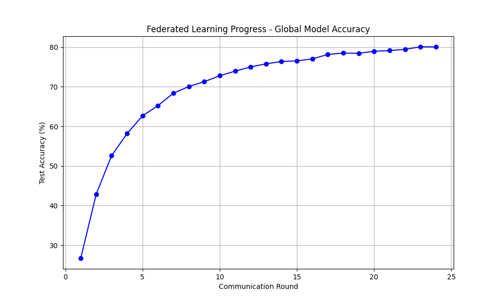
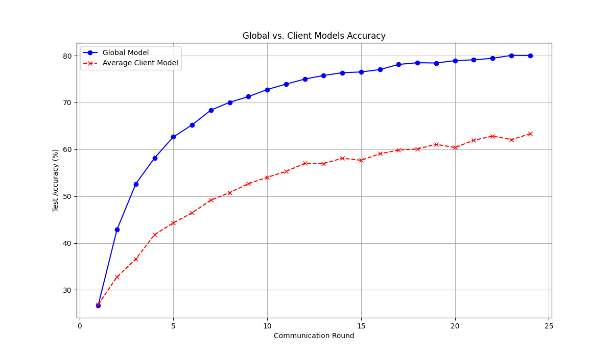

# 🚀 Federated Learning on CIFAR-10  

A PyTorch implementation of **Federated Learning** using the **CIFAR-10 dataset**, simulating decentralized training across multiple clients with **non-IID data distribution**. This project employs a **Convolutional Neural Network (CNN)** and uses the **Federated Averaging (FedAvg) algorithm** for model aggregation.  

## 📌 Features  

- **Federated Learning Simulation**: Simulates a decentralized training environment with multiple clients.  
- **Non-IID Data Partitioning**: Uses Dirichlet distribution to create non-uniform client datasets.  
- **Convolutional Neural Network (CNN)**: A simple yet effective CNN for image classification.  
- **Federated Averaging (FedAvg)**: Aggregates client models to update a global model.  
- **Performance Visualization**: Plots global model accuracy vs. individual client performance.  

---

## 📂 Project Structure  

```
rau-federated-learning/
│── data/                     # Dataset storage
│── venv/                     # Virtual environment (ignored in .gitignore)
│── main.py                    # Main script for federated learning
│── checker.py                  # Additional helper script (if applicable)
│── federated_cifar10_model.pth # Trained model
│── fedavg_accuracy.png         # Training progress plot
│── global_vs_client_accuracy.png # Performance comparison plot
│── documentation.html          # Additional documentation (if applicable)
│── .gitignore                  # Ignore unnecessary files
│── README.md                   # Project documentation
```

---

## 🛠 Installation  

### 1️⃣ Clone the Repository  
```sh
git clone https://github.com/mikayelsaghatelyan/rau-federated-learning.git
cd rau-federated-learning
```

### 2️⃣ Create a Virtual Environment  
```sh
python -m venv venv
source venv/bin/activate   # On macOS/Linux
venv\Scripts\activate      # On Windows
```

### 3️⃣ Install Dependencies  
```sh
pip install -r requirements.txt
```

If `requirements.txt` is missing, install dependencies manually:  
```sh
pip install numpy torch torchvision matplotlib
```

---

## 🏃 Running the Federated Learning Simulation  

Run the main script to start training:  
```sh
python main.py
```
The training process consists of **multiple rounds**, where selected clients train their models, and their updates are aggregated into a **global model**.

---

## 📊 Results and Performance  

- **Accuracy Progression**: The global model’s test accuracy is plotted over multiple rounds.  
- **Global vs. Client Accuracy**: Compares the global model’s performance with client models.  

#### 🔹 Training Accuracy (Global Model)  
  

#### 🔹 Global Model vs. Client Models  
  

---

## 📌 Customization  

### 🔹 Adjusting Number of Clients  
Modify `NUM_CLIENTS` in `main.py`:  
```python
NUM_CLIENTS = 10  # Default: 10
```

### 🔹 Changing Data Distribution  
Modify `alpha` in `create_client_datasets()` to control non-IID skewness:  
```python
client_datasets = create_client_datasets(train_dataset, num_clients=NUM_CLIENTS, alpha=0.1)  # Lower alpha = more skewed data
```

### 🔹 Training Rounds  
Adjust `NUM_ROUNDS` for more or fewer rounds:  
```python
NUM_ROUNDS = 50  # Default: 50 rounds
```

---

## 🏆 Future Improvements  

- Implement **differential privacy** for client data protection.  
- Add **adaptive learning rates** for better convergence.  
- Extend support for **heterogeneous client devices** (e.g., edge AI).  

---

## 📜 License  

This project is open-source and available under the **MIT License**.  

---

## 💡 References  

- [Federated Learning Paper (McMahan et al.)](https://arxiv.org/abs/1602.05629)  
- [PyTorch Documentation](https://pytorch.org/docs/stable/index.html)  
- [CIFAR-10 Dataset](https://www.cs.toronto.edu/~kriz/cifar.html)  

---

🔹 *Feel free to fork, improve, and contribute!* 🚀
